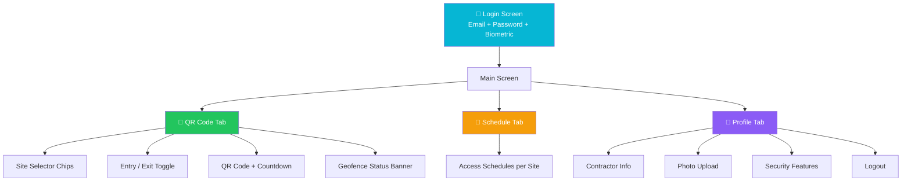

# Android — Contractor App

The Android Contractor App enables contractors to securely generate time-rotating QR codes for site access validation. Built natively with Kotlin and Jetpack Compose.

## Quick Facts

| Property | Value |
|----------|-------|
| Package | `com.pragmatic.contractorqrapp` |
| Language | Kotlin |
| UI | Jetpack Compose + Material Design 3 |
| Min SDK | API 26 (Android 8.0) |
| Target SDK | 35 (Android 15) |
| Theme | Dark with Cyan (#06B6D4) accent |

## Key Dependencies

| Library | Version | Purpose |
|---------|---------|---------|
| Jetpack Compose | BOM 2024.12 | UI framework |
| Retrofit | 2.11.0 | HTTP client |
| OkHttp | 4.12.0 | HTTP transport |
| ZXing | 3.5.3 | QR code generation |
| AndroidX Security | 1.1.0-alpha06 | Encrypted storage |
| AndroidX Biometric | 1.2.0-alpha05 | Fingerprint/Face auth |
| Play Services Location | 21.3.0 | GPS/Geofencing |
| Kotlin Coroutines | 1.8.1 | Async operations |

## Navigation



## API Connection

```
Base URL: https://contractor-api.nubewired.com
Auth: JWT Bearer token
```
