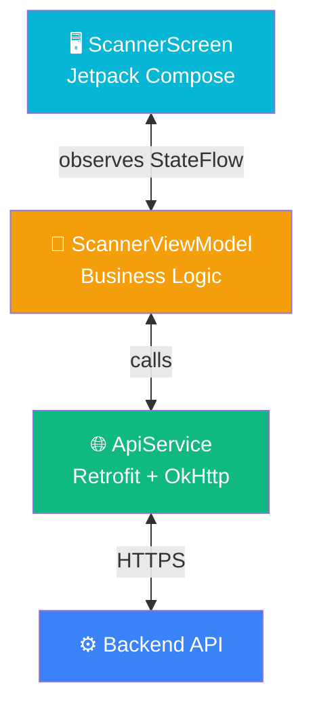
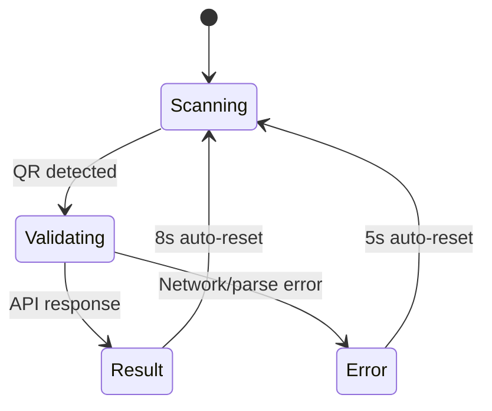
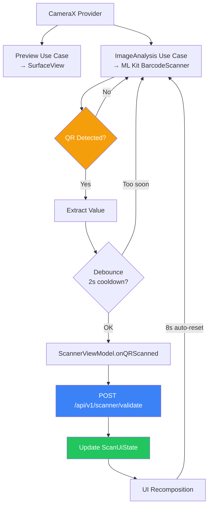

# App Architecture (Android Scanner)

## Project Structure

```
com.pragmatic.contractorqrscanner/
├── MainActivity.kt                    # Entry point with navigation
├── ContractorQRScannerApp.kt         # Application class
├── core/
│   ├── LanguageManager.kt            # Multi-language support
│   ├── network/
│   │   ├── AppUpdateChecker.kt       # Version checking
│   │   └── NetworkMonitor.kt         # Connectivity monitoring
│   └── notifications/
│       └── PushNotificationManager.kt
├── data/
│   ├── SessionManager.kt             # Auth token + guard info
│   ├── ScanHistoryManager.kt         # Local scan audit log
│   ├── OfflineValidationCache.kt     # Offline validation data
│   ├── model/
│   │   └── Models.kt                 # Data classes
│   └── network/
│       ├── ApiService.kt             # Retrofit interface
│       └── ApiClient.kt              # Retrofit + OkHttp config
└── ui/
    ├── auth/
    │   ├── LoginScreen.kt
    │   └── SiteSelectionScreen.kt
    ├── scanner/
    │   ├── ScannerScreen.kt          # Main scanning UI
    │   ├── ScannerViewModel.kt       # Scan logic + validation
    │   ├── CameraPreview.kt          # CameraX + ML Kit
    │   ├── ScannerOverlay.kt         # Visual scan frame
    │   └── ResultViews.kt            # Granted/Denied/Error views
    ├── history/
    │   └── HistoryScreen.kt          # Scan log viewer
    ├── components/
    │   └── DetailRow.kt
    └── theme/                        # Colors, typography, theme
```

## Architecture Pattern

**MVVM** with StateFlow:



## State Machine



### Timing Constants

| Parameter | Value |
|-----------|-------|
| Scan debounce | 2,000 ms |
| Result auto-reset | 8,000 ms |
| Error auto-reset | 5,000 ms |
| Offline cache validity | 48 hours |
| Max scan history | 500 entries |
| Max offline cache | 200 entries |

## Camera Pipeline



## Permissions

| Permission | Purpose |
|------------|---------|
| `CAMERA` | QR code scanning |
| `INTERNET` | API communication |
| `POST_NOTIFICATIONS` | Push notifications |

## Data Persistence

| Data | Storage | Format |
|------|---------|--------|
| Auth token | SharedPreferences | String |
| Guard info | SharedPreferences | JSON (Gson) |
| Scan history | SharedPreferences | JSON array (Gson) |
| Offline cache | SharedPreferences | JSON map (Gson) |
| Language pref | SharedPreferences | String |
