# Android — Scanner App

The Android Scanner App is used by security guards to scan and validate contractor QR codes at site entry/exit points. Built natively with Kotlin and Jetpack Compose.

## Quick Facts

| Property | Value |
|----------|-------|
| Package | `com.pragmatic.contractorqrscanner` |
| Language | Kotlin |
| UI | Jetpack Compose + Material Design 3 |
| Min SDK | API 26 (Android 8.0) |
| Target SDK | 35 (Android 15) |
| Camera | CameraX 1.4.1 + ML Kit Barcode Scanning |
| Theme | Dark with Cyan (#00CDD9) accent |

## Key Dependencies

| Library | Version | Purpose |
|---------|---------|---------|
| Jetpack Compose | BOM 2024.12 | UI framework |
| CameraX | 1.4.1 | Camera preview and capture |
| ML Kit Barcode | 17.3.0 | QR code detection |
| Retrofit | 2.11.0 | HTTP client |
| OkHttp | 4.12.0 | HTTP transport |
| Kotlin Coroutines | 1.8.1 | Async operations |
| Gson | (via Retrofit) | JSON serialization |

## Navigation

```mermaid
flowchart TD
    LOGIN[🔐 Login Screen<br/>Guard Email + Password] --> SITE[📍 Site Selection]
    SITE --> MAIN[Main Screen]

    MAIN --> SCAN[📷 Scanner Tab]
    MAIN --> HIST[📋 History Tab]

    SCAN --> S1[Header: Guard + Site + Status]
    SCAN --> S2[Entry / Exit Toggle]
    SCAN --> S3[Camera Preview + Overlay]
    SCAN --> S4[Result: Granted / Denied]
    SCAN --> S5[Emergency Override]

    HIST --> H1[Search Bar]
    HIST --> H2[Filter: All / Granted / Denied]
    HIST --> H3[Scrollable Audit Log]

    style LOGIN fill:#06b6d4,color:#fff
    style SCAN fill:#22c55e,color:#fff
    style HIST fill:#f59e0b,color:#fff
```

## Scan Flow

1. Guard opens app and logs in
2. Selects or auto-receives assigned site
3. Chooses Entry or Exit scan mode
4. Points camera at contractor's QR code
5. ML Kit detects QR → Extracts Base64 data
6. Sends to backend for validation
7. Displays ACCESS GRANTED (with photo) or DENIED (with reason)
8. Auto-resets after 8 seconds for next scan
