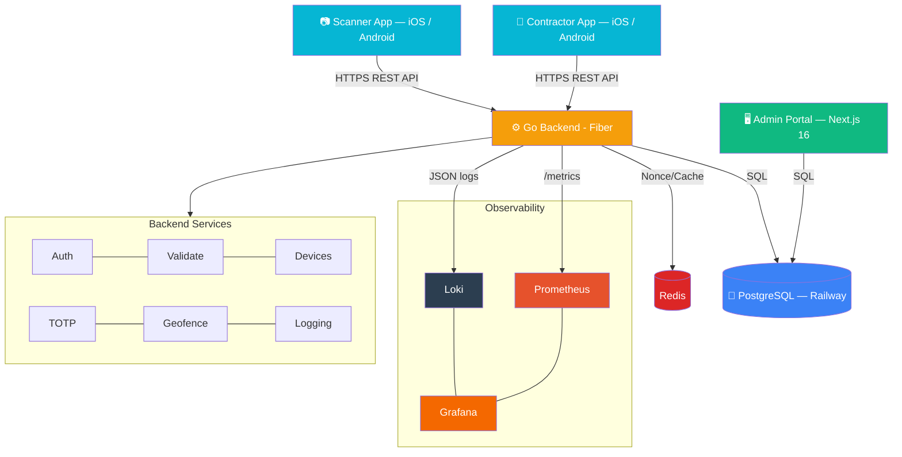
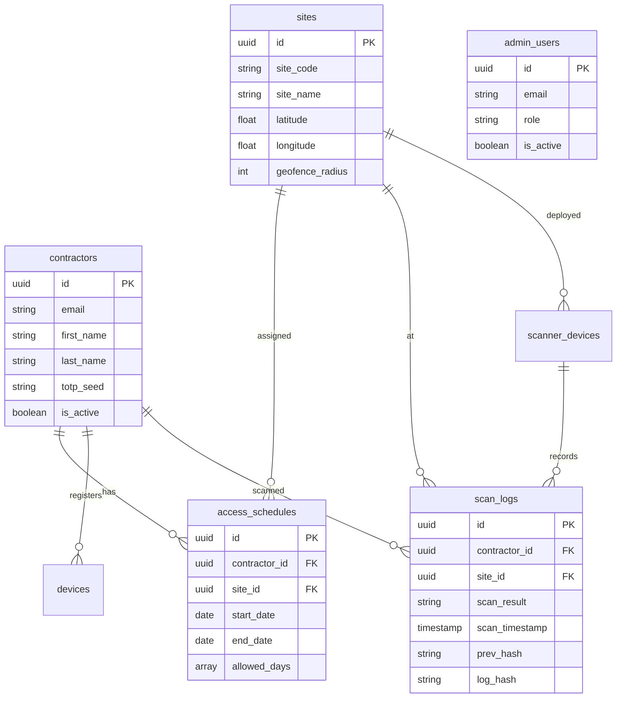

# System Architecture

CAMS follows a client-server architecture with multiple mobile clients connecting to a centralized Go backend, all managed through a Next.js admin portal.

## High-Level Architecture



## Technology Stack

### Backend
- **Language**: Go 1.24+
- **Framework**: Fiber v2 (high-performance HTTP framework)
- **Database**: PostgreSQL 16+ (hosted on Railway)
- **Cache**: Redis 7 (nonce anti-replay, session cache)
- **Auth**: JWT tokens with `golang-jwt/jwt/v5`
- **TOTP**: `pquerna/otp` library (RFC 6238 compliant)
- **Hashing**: bcrypt (cost 14) for passwords
- **Logging**: zerolog (structured JSON to stdout + Loki)
- **Metrics**: Prometheus client (`client_golang`)
- **Monitoring**: Grafana dashboards + alerting

### Mobile Apps
| Feature | Android | iOS |
|---------|---------|-----|
| Language | Kotlin | Swift |
| UI Framework | Jetpack Compose | SwiftUI |
| Networking | Retrofit + OkHttp | URLSession |
| QR Generation | ZXing | CoreImage CIFilter |
| QR Scanning | CameraX + ML Kit | AVFoundation |
| Location | Google Play Services | CoreLocation |
| Biometrics | AndroidX Biometric | LocalAuthentication |
| Storage | EncryptedSharedPreferences | Keychain |

### Admin Portal
- **Framework**: Next.js 16 (App Router)
- **Language**: TypeScript
- **API Layer**: tRPC v11 with SuperJSON
- **Database**: PostgreSQL via `pg` driver (raw SQL)
- **UI**: shadcn/ui + Tailwind CSS
- **Charts**: Recharts
- **Maps**: Leaflet + react-leaflet
- **Auth**: JWT via `jose` + httpOnly cookies
- **Validation**: Zod v4
- **Export**: SheetJS (xlsx)

## Database Schema

### Core Tables

| Table | Purpose |
|-------|---------|
| `contractors` | Contractor profiles with TOTP seeds |
| `sites` | Physical site locations with geofence coordinates |
| `access_schedules` | Time-based access rules per contractor per site |
| `scan_logs` | Audit trail of all QR scans |
| `admin_users` | Portal admin accounts with role-based access |
| `scanner_devices` | Registered scanner tablets (with per-device HMAC keys) |
| `devices` | Contractor device registrations (with per-device HMAC keys) |

### Entity Relationships



### Key Relationships
- A contractor can have **multiple access schedules** across different sites
- Each site has a **geofence radius** for location verification
- Scan logs record the **contractor, site, scanner device, timestamp, and result**
- Admin users have **role-based permissions** (super_admin, site_admin, viewer, auditor)

## API Base URL

```
https://contractor-api.nubewired.com
```

All mobile apps and the admin portal connect to this single backend API.
