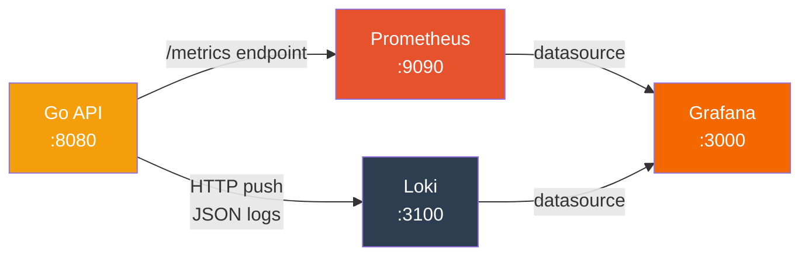

# Observability

CAMS uses a self-hosted observability stack for production monitoring: **zerolog** for structured logging, **Prometheus** for metrics, **Loki** for log aggregation, and **Grafana** for dashboards and alerting.

## Architecture



All services run as Docker containers via `docker-compose.yml` in the backend repo.

## Structured Logging (zerolog)

All backend logging uses `github.com/rs/zerolog` with JSON output. Every log line includes:

- `timestamp` — ISO 8601
- `level` — trace, debug, info, warn, error, fatal
- `service` — always `cams-api`
- `handler` or `component` — which code path emitted the log
- Contextual fields — `contractor_id`, `email`, `site_code`, `error`, etc.

### Example Log Line

```json
{
  "level": "error",
  "service": "cams-api",
  "handler": "qr.validate",
  "contractor_id": "550e8400-e29b-41d4-a716-446655440000",
  "error": "context deadline exceeded",
  "message": "Redis error checking nonce",
  "timestamp": "2026-02-13T20:15:30Z"
}
```

### Log Destinations

| Destination | Transport | Purpose |
|-------------|-----------|---------|
| stdout | Direct write | Container log output (Railway, Docker) |
| Loki | HTTP push (async, best-effort) | Centralized log search in Grafana |

The Loki writer is non-blocking — if Loki is unavailable, logs still go to stdout without impacting API latency.

## Prometheus Metrics

The API exposes a `/metrics` endpoint (outside authentication) scraped by Prometheus every 15 seconds.

### Metric Definitions

| Metric | Type | Labels | Purpose |
|--------|------|--------|---------|
| `http_requests_total` | Counter | method, path, status | Request volume and status distribution |
| `http_request_duration_seconds` | Histogram | method, path | Latency percentiles (P50/P95/P99) |
| `auth_failures_total` | Counter | type | Security event tracking |
| `scan_results_total` | Counter | result, site_code | QR scan grant/deny outcomes |
| `redis_errors_total` | Counter | operation | Redis health monitoring |
| `db_query_duration_seconds` | Histogram | query | Database performance tracking |

### Auth Failure Types

The `auth_failures_total` counter tracks these failure categories:

| Type Label | Trigger |
|------------|---------|
| `invalid_credentials` | Wrong email/password at login |
| `invalid_token` | Expired or malformed JWT |
| `missing_signature` | Request missing X-Signature or X-Timestamp headers |
| `signature_expired` | X-Timestamp outside 5-minute freshness window |
| `hmac_mismatch` | HMAC signature verification failed (tampering) |
| `account_disabled` | Valid credentials but account deactivated |

### Metrics Middleware

Every HTTP request is automatically instrumented by `observability.MetricsMiddleware()`:

- Uses **route patterns** (e.g., `/api/v1/contractors/:id`) not raw paths to avoid label cardinality explosion
- Records request count and latency histogram in a single pass
- Positioned before CORS middleware in the Fiber chain

## Grafana Dashboards

Two dashboards are auto-provisioned on first Grafana startup.

### API Overview Dashboard

| Panel | Visualization | Query |
|-------|--------------|-------|
| Request Rate | Time series by status code | `sum(rate(http_requests_total[1m])) by (status)` |
| Error Rate (%) | Time series with thresholds | `5xx / total * 100` over 5m window |
| Latency P50/P95/P99 | Time series (3 queries) | `histogram_quantile()` over `http_request_duration_seconds` |
| Request Rate by Endpoint | Time series by path | `sum(rate(http_requests_total[1m])) by (path)` |
| DB Query Latency | Time series by query label | `histogram_quantile(0.95, ...)` over `db_query_duration_seconds` |
| Requests by Method | Donut chart | `sum(increase(http_requests_total[1h])) by (method)` |

### Security Dashboard

| Panel | Visualization | Query |
|-------|--------------|-------|
| Auth Failures by Type | Stacked time series | `sum(rate(auth_failures_total[5m])) by (type)` |
| HMAC Rejections | Time series | `auth_failures_total{type=~"missing_signature\|signature_expired\|hmac_mismatch"}` |
| Scan Grant/Deny Ratio | Donut chart (green/red) | `sum(increase(scan_results_total[1h])) by (result)` |
| 401/403 Response Trends | Time series | `http_requests_total{status="401"\|"403"}` |
| Redis Error Events | Bar chart | `sum(increase(redis_errors_total[5m])) by (operation)` |
| Top Denied Sites | Horizontal bar gauge | `topk(10, sum(increase(scan_results_total{result="denied"}[1h])) by (site_code))` |
| Scan Results by Site | Stacked time series | `sum(rate(scan_results_total[5m])) by (result, site_code)` |

## Alert Rules

Six alerts are auto-provisioned in Grafana:

| Alert | Condition | Severity | Purpose |
|-------|-----------|----------|---------|
| Auth Failure Spike | >10 auth failures in 5 min | Critical | Brute-force or credential stuffing detection |
| HMAC Rejection Spike | >5 HMAC mismatches in 5 min | Critical | Request tampering detection |
| Redis Errors | Any `redis_errors_total` increment | Critical | Nonce anti-replay may be compromised |
| High Error Rate | >5% of requests return 5xx for 5 min | Warning | Backend stability |
| High Latency | P95 latency >2s for 5 min | Warning | Performance degradation |
| Scan Denial Anomaly | >80% scan denials in 15 min | Warning | Misconfiguration or access policy issue |

## File Structure

```
contractor-qr-api/
├── internal/observability/
│   ├── logger.go              # zerolog init + Loki HTTP push writer
│   ├── metrics.go             # Prometheus metric definitions + InitMetrics()
│   └── middleware.go          # Fiber middleware for auto HTTP metrics
├── docker-compose.yml         # Full stack: API + PG + Redis + Prometheus + Loki + Grafana
└── monitoring/
    ├── prometheus/
    │   └── prometheus.yml     # Scrape config (15s interval)
    ├── loki/
    │   └── loki-config.yaml   # TSDB storage, 30-day retention
    └── grafana/
        ├── provisioning/
        │   ├── datasources/
        │   │   └── datasources.yaml   # Prometheus + Loki
        │   ├── dashboards/
        │   │   └── dashboards.yaml    # Dashboard file provider
        │   └── alerting/
        │       └── alerts.yaml        # 6 alert rules
        └── dashboards/
            ├── api-overview.json      # Request rate, latency, errors
            └── security.json          # Auth failures, scan results, HMAC
```

## Running Locally

```bash
docker compose up -d

# Verify
curl http://localhost:8080/metrics   # Prometheus metrics
open http://localhost:3000           # Grafana (admin/admin)
```

Grafana auto-provisions both datasources and dashboards on first boot — no manual configuration needed.
