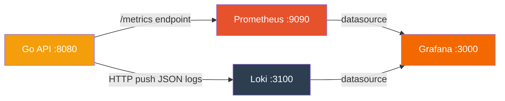

# Observability

CAMS uses a self-hosted observability stack for production monitoring: **zerolog** for structured logging, **Prometheus** for metrics, **Loki** for log aggregation, and **Grafana** for dashboards and alerting.

## Architecture



All services run as Docker containers via `docker-compose.yml` in the backend repo.

---

## Understanding the Metrics

CAMS exposes 6 Prometheus metrics. Each metric is a time series — a stream of timestamped values that Prometheus scrapes every 15 seconds from the `/metrics` endpoint.

### Metric Types

- **Counter** — A number that only goes up (e.g. total requests). To see the *rate* of change, you wrap it in `rate()` or `increase()`.
- **Histogram** — Records the distribution of values (e.g. response times). Stores data in buckets, which lets you compute percentiles like P50/P95/P99.

---

## Metric Reference

### `http_requests_total` (Counter)

**What it measures:** Every single HTTP request that hits the API, regardless of outcome.

| Label | Values | Meaning |
|-------|--------|---------|
| `method` | GET, POST, PUT, DELETE | HTTP method |
| `path` | `/health`, `/api/v1/admin/login`, `/api/v1/contractors/:id`, `unmatched`, etc. | The **route pattern** (not the actual URL with IDs). Unmatched routes (404s) are normalized to `"unmatched"` to prevent cardinality explosion. |
| `status` | 200, 400, 401, 403, 404, 500 | HTTP response status code |

**What to look for:**
- A spike in `status=401` means something is sending unauthorized requests (bad tokens, missing HMAC)
- A spike in `status=500` means the backend is crashing on some requests (check logs)
- `status=200` is healthy traffic
- `status=400` means clients are sending malformed requests

**Example values you'll see:**
```
http_requests_total{method="POST", path="/api/v1/admin/login", status="200"} = 45
http_requests_total{method="POST", path="/api/v1/auth/login", status="401"} = 12
http_requests_total{method="GET", path="/health", status="200"} = 300
```

---

### `http_request_duration_seconds` (Histogram)

**What it measures:** How long each request took to process, from the moment Fiber receives it to the moment the response is sent.

| Label | Values | Meaning |
|-------|--------|---------|
| `method` | GET, POST, PUT, DELETE | HTTP method |
| `path` | Route pattern | Which endpoint was called |

The histogram automatically creates buckets: 5ms, 10ms, 25ms, 50ms, 100ms, 250ms, 500ms, 1s, 2.5s, 5s, 10s. This lets Grafana compute percentiles.

**What to look for:**
- **P50** (median) — Half of requests are faster than this. Should be under 50ms for most endpoints.
- **P95** — 95% of requests are faster than this. Should be under 500ms. If this exceeds 2s, the "High Latency" alert fires.
- **P99** — Only 1% of requests are slower than this. Shows worst-case performance.
- If P95 is climbing while P50 stays flat, a small percentage of requests are getting slow (probably a specific endpoint or DB query).

---

### `auth_failures_total` (Counter)

**What it measures:** Every authentication or authorization failure, categorized by type.

| Type Label | What Happened | Where It Fires | Severity |
|------------|---------------|----------------|----------|
| `invalid_credentials` | Wrong email or password at login | Contractor login, scanner login, admin login | Normal (users mistype passwords). Concerning if >10/min (brute force). |
| `invalid_token` | JWT token is expired, malformed, or has a bad signature | Any protected endpoint (middleware rejects it) | Normal for expired tokens. Concerning if sudden spike (stolen token being replayed). |
| `missing_signature` | Request to a mobile endpoint is missing `X-Signature` or `X-Timestamp` headers | HMAC middleware on contractor/scanner routes | Usually means someone is hitting mobile endpoints without the app (curl, Postman, attacker). |
| `signature_expired` | The `X-Timestamp` header is more than 5 minutes old | HMAC middleware | Could be clock drift on a mobile device, or a replay attack with an old request. |
| `hmac_mismatch` | The HMAC-SHA256 signature doesn't match. The request body was tampered with, or the signing key is wrong. | HMAC middleware | **Most serious.** This means either (a) a man-in-the-middle modified the request, or (b) an attacker is trying to forge requests. |
| `account_disabled` | Correct password, but the admin has deactivated this contractor/guard account | Login handlers | Expected when an admin disables someone. Investigate if the user claims they should still have access. |

**What to look for:**
- `invalid_credentials` at 1-2/min is normal. At 10+/min it's a brute-force attack.
- `hmac_mismatch` should be zero in normal operation. Any non-zero value is suspicious.
- `missing_signature` from known endpoints means someone is probing the API without using the mobile app.

---

### `scan_results_total` (Counter)

**What it measures:** The outcome of every QR code scan — granted or denied — broken down by site.

| Label | Values | Meaning |
|-------|--------|---------|
| `result` | `granted`, `denied` | Whether the contractor was allowed in |
| `site_code` | `SITE001`, `SITE002`, etc. | Which site the scan was for |

**Denial reasons** (logged in scan_logs, not in the metric label):
- Contractor not found
- Account disabled
- Invalid TOTP token (expired QR code)
- Device not registered
- Site not found
- No active access schedule
- Wrong day of week
- Outside allowed time window
- Replay attack (nonce already used)

**What to look for:**
- A healthy system has mostly `granted` scans during work hours.
- A denial rate above 80% for 15 minutes triggers the "Scan Denial Anomaly" alert — this usually means a schedule misconfiguration or a site code mismatch.
- If one specific `site_code` has high denials but others are fine, check that site's access schedules.

---

### `redis_errors_total` (Counter)

**What it measures:** Any Redis operation failure.

| Label | Values | Meaning |
|-------|--------|---------|
| `operation` | `nonce_check` | Failed to check if a QR nonce has been used before |
| `operation` | `nonce_set` | Failed to mark a nonce as used after a successful scan |

**What to look for:**
- This should be **zero** at all times. Any increment is a **critical** alert.
- If `nonce_check` fails, the system cannot verify replay attacks — a used QR code might be accepted again.
- If `nonce_set` fails, a valid QR code's nonce won't be recorded, meaning it could potentially be replayed.
- Common causes: Redis is down, connection timeout, out of memory.

---

### `db_query_duration_seconds` (Histogram)

**What it measures:** How long each database query takes, broken down by query type.

| Label | Values | Meaning |
|-------|--------|---------|
| `query` | `contractor_login_lookup` | Fetching contractor record during login (email lookup + bcrypt verify) |
| `query` | `guard_login_lookup` | Fetching guard/admin record during scanner login |
| `query` | `admin_login_lookup` | Fetching admin record during admin portal login |
| `query` | `qr_contractor_lookup` | Fetching contractor during QR validation (by UUID) |

**What to look for:**
- Login queries include bcrypt comparison which is intentionally slow (~60-100ms). This is normal.
- QR contractor lookups should be fast (&lt;10ms) since they're UUID primary key lookups.
- If query times start climbing, check PostgreSQL: connection pool exhaustion, missing indexes, or high load.

---

## Grafana Dashboards — What You're Seeing

### CAMS API Overview Dashboard

Navigate to: **Dashboards → CAMS → CAMS API Overview**

#### Panel: Request Rate (req/s)

**What it shows:** Colored lines, one per HTTP status code, showing how many requests per second the API is handling.

**How to read it:**
- Green/blue lines (200s) = successful requests. This is your normal traffic.
- Red/orange lines (401, 403) = auth failures. A small amount is normal. A spike means trouble.
- A flat line at zero means no traffic (e.g. off-hours).
- A sudden drop to zero means the API is down.

**PromQL:** `sum(rate(http_requests_total[1m])) by (status)`

#### Panel: Error Rate (%)

**What it shows:** A single line showing the percentage of requests that returned 5xx (server error) status codes.

**How to read it:**
- Should be at or near 0% at all times.
- 1-2% = something is occasionally failing. Check logs.
- Above 5% for 5 minutes = the "High Error Rate" alert fires. Something is seriously wrong.

**PromQL:** `sum(rate(http_requests_total{status=~"5.."}[5m])) / sum(rate(http_requests_total[5m])) * 100`

#### Panel: Latency P50 / P95 / P99

**What it shows:** Three lines representing response time percentiles.

**How to read it:**
- P50 (median) — Should be under 50ms for most endpoints. This is your "typical" response time.
- P95 — Should be under 500ms. This is the "slow but not unusual" response time.
- P99 — Can be up to 1s. This is your worst-case for normal traffic.
- If P95 crosses 2s for 5 minutes, the "High Latency" alert fires.
- A gap between P50 and P95 means some requests are much slower than average (likely DB-heavy endpoints like contractor list with pagination).

**PromQL:**
```promql
histogram_quantile(0.50, sum(rate(http_request_duration_seconds_bucket[5m])) by (le))
histogram_quantile(0.95, sum(rate(http_request_duration_seconds_bucket[5m])) by (le))
histogram_quantile(0.99, sum(rate(http_request_duration_seconds_bucket[5m])) by (le))
```

#### Panel: Request Rate by Endpoint

**What it shows:** One line per API endpoint, showing which endpoints get the most traffic.

**How to read it:**
- `/health` and `/metrics` will be the most frequent (automated scraping).
- Among real endpoints, `/api/v1/admin/dashboard/stats` is usually highest (admin portal polls it).
- If an unexpected endpoint suddenly spikes, someone may be hammering the API.

**PromQL:** `sum(rate(http_requests_total[1m])) by (path)`

#### Panel: DB Query Latency

**What it shows:** P95 latency for each type of database query.

**How to read it:**
- `contractor_login_lookup` and `guard_login_lookup` include bcrypt, so 50-100ms is expected.
- `qr_contractor_lookup` is a simple UUID lookup, should be &lt;10ms.
- If any query latency starts climbing over time, the database may need attention (vacuuming, index rebuilding, connection pool limits).

**PromQL:** `histogram_quantile(0.95, sum(rate(db_query_duration_seconds_bucket[5m])) by (le, query))`

#### Panel: Requests by Method

**What it shows:** A donut chart breaking down traffic by HTTP method (GET vs POST vs PUT vs DELETE).

**How to read it:**
- Mostly GET (dashboard reads, profile fetches) and POST (logins, QR validations).
- PUT/DELETE should be small (admin CRUD updates/deletes).
- If DELETE suddenly spikes, check if someone is bulk-deleting resources.

**PromQL:** `sum(increase(http_requests_total[1h])) by (method)`

---

### CAMS Security Dashboard

Navigate to: **Dashboards → CAMS → CAMS Security**

#### Panel: Auth Failures by Type

**What it shows:** A stacked area chart where each color represents a different failure type. The height of each band shows how many failures per second of that type.

**How to read it:**
- **Yellow/orange band (invalid_credentials):** Normal background noise from mistyped passwords. If this band suddenly grows tall, someone is brute-forcing logins.
- **Red band (hmac_mismatch):** Should be zero. Any red means request tampering.
- **Blue band (missing_signature):** Someone hitting mobile endpoints without the app. Could be a developer testing, or an attacker probing.
- **Purple band (signature_expired):** Old requests being replayed, or mobile devices with incorrect clocks.
- **Gray band (invalid_token):** Expired JWTs or bad tokens. Normal when tokens expire, concerning if constant.

**PromQL:** `sum(rate(auth_failures_total[5m])) by (type)`

#### Panel: HMAC Rejections Over Time

**What it shows:** Two lines focused specifically on HMAC-related failures (the most security-critical ones).

**How to read it:**
- The orange line shows all HMAC rejections combined (missing + expired + mismatch).
- The second line shows just signature mismatches (the most serious).
- Both should be flat at zero during normal operation.
- Any sustained activity here warrants investigation — check the Loki logs for source IPs and request details.

**PromQL:**
```promql
sum(rate(auth_failures_total{type=~"missing_signature|signature_expired|hmac_mismatch"}[5m]))
sum(rate(auth_failures_total{type="hmac_mismatch"}[5m]))
```

#### Panel: Scan Grant / Deny Ratio

**What it shows:** A donut chart. Green = granted scans, Red = denied scans.

**How to read it:**
- A healthy system is mostly green (80-95% granted).
- Some denials are normal (contractor arrives early, wrong day, etc.).
- If the chart is mostly red, check: Are access schedules configured correctly? Are contractors using expired QR codes? Is the TOTP clock drifting?

**PromQL:** `sum(increase(scan_results_total[1h])) by (result)`

#### Panel: 401/403 Response Trends

**What it shows:** Two lines — one for 401 (Unauthorized) responses, one for 403 (Forbidden).

**How to read it:**
- **401 line:** Tracks requests that failed authentication (bad token, no token, HMAC failure). Correlates with `auth_failures_total`.
- **403 line:** Tracks requests that passed authentication but failed authorization (e.g. a viewer role trying to create a contractor). Should be very low.
- A divergence between the two can reveal permission issues — if 403 spikes, someone with the wrong role is trying to do admin operations.

**PromQL:**
```promql
sum(rate(http_requests_total{status="401"}[5m]))
sum(rate(http_requests_total{status="403"}[5m]))
```

#### Panel: Redis Error Events

**What it shows:** A bar chart showing Redis errors over time, colored by operation type.

**How to read it:**
- Should be completely empty (no bars). Any bar means Redis had an error.
- `nonce_check` bars mean the anti-replay system couldn't verify if a QR code was already used.
- `nonce_set` bars mean a used QR nonce couldn't be recorded, leaving a replay window.
- If bars appear: check Redis connectivity, memory usage, and whether the container is healthy.

**PromQL:** `sum(increase(redis_errors_total[5m])) by (operation)`

#### Panel: Top Denied Sites (Last 1h)

**What it shows:** A horizontal bar gauge ranking sites by number of scan denials in the last hour.

**How to read it:**
- The longest bar has the most denials.
- If one site has far more denials than others, investigate: wrong schedule config? Site code mismatch in the scanner app? Geofence radius too small?
- No bars means no denials in the last hour (good).

**PromQL:** `topk(10, sum(increase(scan_results_total{result="denied"}[1h])) by (site_code))`

#### Panel: Scan Results Over Time by Site

**What it shows:** A stacked time series showing scan activity per site, split by granted/denied.

**How to read it:**
- Each color band represents a site + result combination.
- You can see which sites are busiest and when.
- Useful for spotting patterns — e.g. if SITE003 has denials every morning at 6am, the start_time in the schedule might be wrong.

**PromQL:** `sum(rate(scan_results_total[5m])) by (result, site_code)`

---

## Alert Rules — When Things Go Wrong

Six alerts are auto-provisioned. They appear under **Alerting → Alert rules** in Grafana.

| Alert | Fires When | What It Means | What To Do |
|-------|------------|---------------|------------|
| **Auth Failure Spike** | >10 auth failures in 5 min | Brute-force or credential stuffing attack | Check source IPs in Loki. Consider enabling rate limiting. |
| **HMAC Rejection Spike** | >5 HMAC mismatches in 5 min | Request tampering or forged API calls | Investigate immediately. Check if HMAC key was leaked. Rotate keys if needed. |
| **Redis Errors** | Any `redis_errors_total` increment | Nonce anti-replay compromised | Check Redis container health. Restart if needed. While Redis is down, replay attacks are possible. |
| **High Error Rate** | >5% 5xx responses for 5 min | Backend is crashing on requests | Check error logs in Loki: `{app="cams-api"} \|= "error"`. Look for DB connection failures, nil pointer panics, etc. |
| **High Latency** | P95 > 2s for 5 min | Requests are very slow | Check DB query latency panel. Possible causes: PG connection pool exhaustion, slow query, high CPU. |
| **Scan Denial Anomaly** | >80% denial rate in 15 min | Most scans are being denied | Check access schedules in admin portal. Verify site codes match. Check if TOTP clock is drifting. |

---

## Useful PromQL Queries for Grafana Explore

Open **Grafana → Explore** (compass icon in sidebar), select **Prometheus** datasource, and paste these queries.

### Traffic & Performance

```promql
# Total requests per second right now
sum(rate(http_requests_total[1m]))

# Requests per second by endpoint
sum(rate(http_requests_total[1m])) by (path)

# Only error responses (4xx + 5xx)
sum(rate(http_requests_total{status=~"[45].."}[5m])) by (path, status)

# Average response time per endpoint
sum(rate(http_request_duration_seconds_sum[5m])) by (path) / sum(rate(http_request_duration_seconds_count[5m])) by (path)

# P99 latency per endpoint
histogram_quantile(0.99, sum(rate(http_request_duration_seconds_bucket[5m])) by (le, path))

# Slowest endpoints (P95, top 5)
topk(5, histogram_quantile(0.95, sum(rate(http_request_duration_seconds_bucket[5m])) by (le, path)))

# Total requests in the last 24h
sum(increase(http_requests_total[24h]))

# Total requests per endpoint in the last hour
sum(increase(http_requests_total[1h])) by (path)
```

### Security & Auth

```promql
# All auth failures per minute
sum(rate(auth_failures_total[1m]))

# Auth failures by type over time
sum(rate(auth_failures_total[5m])) by (type)

# Only HMAC-related failures
sum(rate(auth_failures_total{type=~"missing_signature|signature_expired|hmac_mismatch"}[5m])) by (type)

# Brute force indicator: credential failures per minute
sum(rate(auth_failures_total{type="invalid_credentials"}[1m]))

# Ratio of 401 responses to total traffic (unauthorized %)
sum(rate(http_requests_total{status="401"}[5m])) / sum(rate(http_requests_total[5m])) * 100
```

### QR Scanning

```promql
# Scans per minute (all sites)
sum(rate(scan_results_total[1m]))

# Grant vs deny rate
sum(rate(scan_results_total[5m])) by (result)

# Denial rate as percentage
sum(rate(scan_results_total{result="denied"}[5m])) / sum(rate(scan_results_total[5m])) * 100

# Scans per site
sum(increase(scan_results_total[1h])) by (site_code)

# Denials per site (find problematic sites)
sum(increase(scan_results_total{result="denied"}[1h])) by (site_code)

# Sites with the most denials
topk(5, sum(increase(scan_results_total{result="denied"}[1h])) by (site_code))
```

### Database & Infrastructure

```promql
# DB query P95 latency by query type
histogram_quantile(0.95, sum(rate(db_query_duration_seconds_bucket[5m])) by (le, query))

# Average DB query time
sum(rate(db_query_duration_seconds_sum[5m])) by (query) / sum(rate(db_query_duration_seconds_count[5m])) by (query)

# Total Redis errors (should be 0)
sum(redis_errors_total)

# Redis errors over time
sum(increase(redis_errors_total[5m])) by (operation)
```

---

## Loki Log Queries

Open **Grafana → Explore**, select **Loki** datasource.

```logql
# All API logs
{app="cams-api"}

# Only errors
{app="cams-api"} |= "error"

# Logs from a specific handler
{app="cams-api"} | json | handler="qr.validate"

# Login failures
{app="cams-api"} | json | handler="auth.Login" |= "invalid"

# HMAC failures
{app="cams-api"} |= "HMAC"

# Logs for a specific contractor
{app="cams-api"} | json | contractor_id="550e8400-e29b-41d4-a716-446655440000"

# Redis errors
{app="cams-api"} | json | message=~".*Redis.*"
```

---

## Structured Logging (zerolog)

All backend logging uses `github.com/rs/zerolog` with JSON output. Every log line includes:

- `timestamp` — ISO 8601
- `level` — trace, debug, info, warn, error, fatal
- `service` — always `cams-api`
- `handler` or `component` — which code path emitted the log
- Contextual fields — `contractor_id`, `email`, `site_code`, `error`, etc.

### Example Log Lines

**Successful login:**
```json
{"level":"info","service":"cams-api","handler":"auth.Login","email":"john@company.com","message":"Login successful","timestamp":"2026-02-13T20:15:30Z"}
```

**QR validation denied:**
```json
{"level":"warn","service":"cams-api","handler":"qr.validate","contractor_id":"550e8400-...","site_code":"SITE001","message":"Access denied: outside allowed hours","timestamp":"2026-02-13T06:15:30Z"}
```

**Redis error:**
```json
{"level":"error","service":"cams-api","handler":"qr.validate","error":"dial tcp: connection refused","message":"Redis error checking nonce","timestamp":"2026-02-13T20:15:30Z"}
```

### Log Destinations

| Destination | Transport | Purpose |
|-------------|-----------|---------|
| stdout | Direct write | Container log output (Railway, Docker) |
| Loki | HTTP push (async, best-effort) | Centralized log search in Grafana |

The Loki writer is non-blocking with a bounded channel (capacity 1,000) and single sender goroutine. Messages are dropped if the channel is full. If Loki is unavailable, logs still go to stdout without impacting API latency. The Loki HTTP client has a 5-second timeout to prevent connection hangs.

---

## File Structure

```
contractor-qr-api/
├── internal/observability/
│   ├── logger.go              # zerolog init + Loki HTTP push writer
│   ├── metrics.go             # Prometheus metric definitions + InitMetrics()
│   └── middleware.go          # Fiber middleware for auto HTTP metrics
├── docker-compose.yml         # Full stack: API + PG + Redis + Prometheus + Loki + Grafana
└── monitoring/
    ├── prometheus/
    │   └── prometheus.yml     # Scrape config (15s interval)
    ├── loki/
    │   └── loki-config.yaml   # TSDB storage, 30-day retention
    └── grafana/
        ├── provisioning/
        │   ├── datasources/
        │   │   └── datasources.yaml   # Prometheus (uid: prometheus) + Loki (uid: loki)
        │   ├── dashboards/
        │   │   └── dashboards.yaml    # Dashboard file provider
        │   └── alerting/
        │       └── alerts.yaml        # 6 alert rules
        └── dashboards/
            ├── api-overview.json      # Request rate, latency, errors
            └── security.json          # Auth failures, scan results, HMAC
```

## Running Locally

```bash
docker compose up -d

# Verify
curl http://localhost:8080/metrics   # Prometheus metrics
open http://localhost:3000           # Grafana (admin/admin)
```

Grafana auto-provisions datasources (with matching UIDs), dashboards, and alert rules on first boot — no manual configuration needed.
