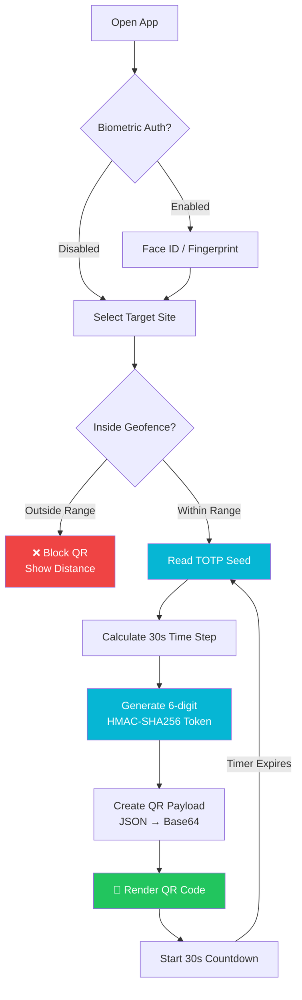
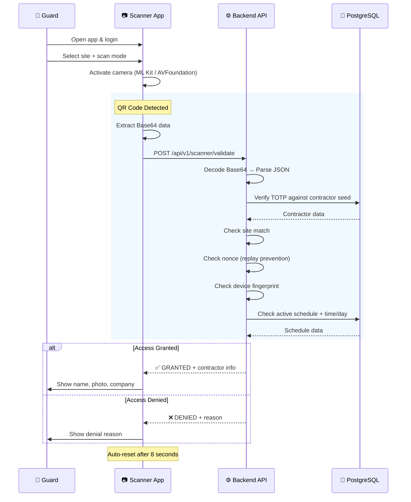

# QR Code Flow

This page documents the end-to-end flow of QR code generation, scanning, and validation.

## Generation Flow (Contractor App)



## QR Payload

The QR code contains a Base64-encoded JSON payload:

```json
{
  "contractor_id": "550e8400-e29b-41d4-a716-446655440000",
  "timestamp": 1700000000,
  "totp": "482916",
  "site_code": "NAMA-HQ-001",
  "nonce": "7f3d2b1a-4e5c-6d7f-8a9b-0c1d2e3f4a5b",
  "device_fingerprint": "a1b2c3d4e5f6",
  "access_mode": "entry"
}
```

| Field | Purpose |
|-------|---------|
| `contractor_id` | UUID of the contractor |
| `timestamp` | Unix timestamp of generation |
| `totp` | 6-digit TOTP token (valid for 30s) |
| `site_code` | Target site identifier |
| `nonce` | One-time use identifier (prevents replay) |
| `device_fingerprint` | Generating device's unique ID |
| `access_mode` | "entry" or "exit" |

## Validation Flow (Scanner App → Backend)



## Validation Checks (Backend)

The backend performs these checks in order:

1. **QR Decode** — Valid Base64, valid JSON structure
2. **TOTP Verify** — Token matches contractor's seed within time window
3. **Site Match** — QR site code matches scanner's assigned site
4. **Nonce Check** — Not previously used (prevents replay attacks)
5. **Device Check** — Device fingerprint matches registered device
6. **Schedule Check** — Active schedule exists for contractor + site
7. **Time Check** — Current time within allowed hours
8. **Day Check** — Current day within allowed days
9. **Date Check** — Current date within schedule start/end dates
10. **Status Check** — Contractor account and schedule are active

## Denial Reasons

| Code | Reason | Description |
|------|--------|-------------|
| `invalid_qr` | Invalid QR Code | Cannot decode or parse QR data |
| `invalid_totp` | Invalid Token | TOTP token doesn't match |
| `wrong_site` | Wrong Site | QR generated for different site |
| `replay` | Replay Detected | Nonce already used |
| `no_schedule` | No Schedule | No active access schedule found |
| `outside_hours` | Outside Hours | Current time not in allowed range |
| `wrong_day` | Wrong Day | Current day not in allowed days |
| `expired_schedule` | Schedule Expired | Schedule end date has passed |
| `inactive` | Account Inactive | Contractor or schedule deactivated |
| `unregistered_device` | Unregistered Device | Device fingerprint not recognized |

## Offline Fallback (Scanner)

When the scanner device has no network connectivity:

1. Check local offline validation cache
2. If contractor was previously granted access within 48 hours → **GRANT** (with offline indicator)
3. If not in cache → Show network error
4. All offline decisions are logged and synced when connectivity returns

The offline cache stores up to **200 entries** with a **48-hour validity** window.

## Emergency Override

Guards can bypass QR scanning in emergencies:

1. Tap "Emergency Override" button
2. Enter reason for override (required)
3. Choose: Grant or Deny
4. Action is logged with guard ID, timestamp, and reason
5. Displayed with yellow warning badge in audit trail
