# iOS — Contractor App

The iOS Contractor App enables contractors to generate TOTP-based QR codes for site access. Built natively with Swift and SwiftUI.

## Quick Facts

| Property | Value |
|----------|-------|
| Bundle ID | `com.pragmatic.contractorqrapp` |
| Language | Swift |
| UI | SwiftUI |
| Min iOS | 16.0 |
| Theme | Dark with Cyan accent |

## Key Frameworks

| Framework | Purpose |
|-----------|---------|
| SwiftUI | Declarative UI |
| CoreImage | QR code generation (CIFilter) |
| CoreLocation | GPS and geofencing |
| LocalAuthentication | Face ID / Touch ID |
| Security (Keychain) | Encrypted credential storage |
| AVFoundation | Camera (photo capture) |
| CryptoKit | HMAC-SHA256 for TOTP |

## Navigation

```mermaid
flowchart TD
    LOGIN[🔐 Login Screen<br/>Email + Password + Biometric] --> MAIN[Main TabView]

    MAIN --> QR[🔲 QR Code Tab]
    MAIN --> SCHED[📅 Schedule Tab]
    MAIN --> PROF[👤 Profile Tab]

    QR --> Q1[Site Picker]
    QR --> Q2[Entry / Exit Toggle]
    QR --> Q3[QR Code + Countdown Ring]
    QR --> Q4[Geofence Status]

    SCHED --> S1[Access Schedules List]

    PROF --> P1[Contractor Info + Photo]
    PROF --> P2[Security Features]
    PROF --> P3[Logout]

    style LOGIN fill:#06b6d4,color:#fff
    style QR fill:#22c55e,color:#fff
    style SCHED fill:#f59e0b,color:#fff
    style PROF fill:#8b5cf6,color:#fff
```



## API Connection

```
Base URL: https://contractor-api.nubewired.com
Auth: JWT Bearer token
Networking: URLSession with async/await
```
