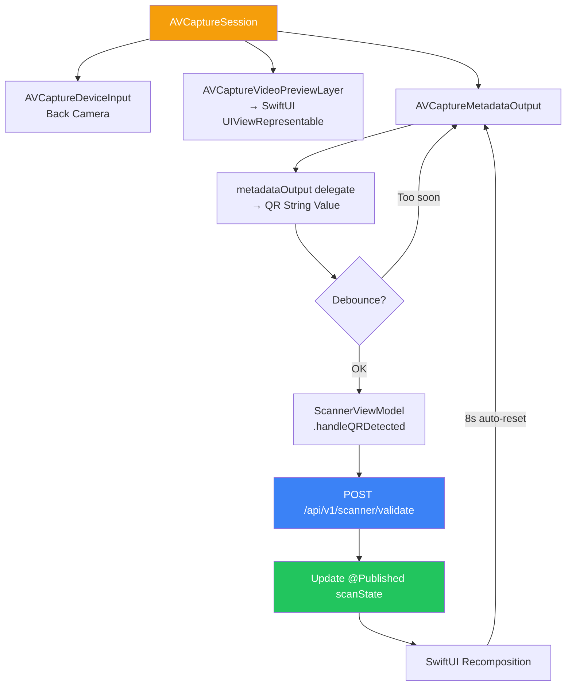
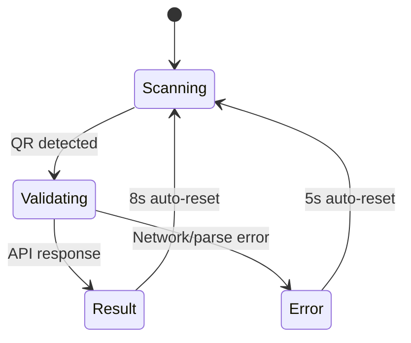

# App Architecture (iOS Scanner)

## Project Structure

```
ContractorQRScanner/
├── ContractorQRScannerApp.swift    # App entry point
├── ContentView.swift                # Root view with navigation
├── Core/
│   ├── LocalizationManager.swift    # EN/AR language switching
│   ├── KeychainManager.swift        # Secure storage
│   └── NetworkMonitor.swift         # Connectivity tracking
├── Models/
│   ├── Guard.swift                  # Guard data model
│   ├── Site.swift                   # Site data model
│   ├── ScanResult.swift             # Validation result
│   ├── ScanHistoryEntry.swift       # History record
│   └── APIModels.swift              # Request/Response DTOs
├── Network/
│   ├── APIClient.swift              # URLSession HTTP client
│   ├── APIEndpoints.swift           # Endpoint definitions
│   └── SessionManager.swift         # Token + guard info
├── ViewModels/
│   ├── LoginViewModel.swift         # Authentication logic
│   ├── ScannerViewModel.swift       # Scan + validate logic
│   └── HistoryViewModel.swift       # History management
├── Views/
│   ├── Auth/
│   │   ├── LoginView.swift
│   │   └── SiteSelectionView.swift
│   ├── Scanner/
│   │   ├── ScannerView.swift        # Main scanner UI
│   │   ├── CameraPreview.swift      # AVCaptureSession wrapper
│   │   ├── ScannerOverlay.swift     # Visual scan frame
│   │   └── ResultOverlay.swift      # Granted/Denied display
│   ├── History/
│   │   └── HistoryView.swift
│   └── Components/
│       └── DetailRow.swift
└── Utilities/
    └── Extensions.swift             # Swift extensions
```

## Architecture Pattern

**MVVM** with SwiftUI:
- ViewModels as `ObservableObject`
- `@Published` properties for reactive UI
- `async/await` for network operations
- Combine for event streams (camera delegate)

## Camera Pipeline



## State Machine



## Data Persistence

| Data | Storage | Encoding |
|------|---------|----------|
| Auth token | Keychain | String |
| Guard info | UserDefaults | Codable JSON |
| Site assignment | UserDefaults | Codable JSON |
| Scan history | UserDefaults | Codable JSON array |
| Offline cache | UserDefaults | Codable JSON |
| Language pref | UserDefaults | String |

## Permissions

| Permission | Usage Description |
|------------|------------------|
| Camera | "CAMS needs camera access to scan contractor QR codes" |
| Location (optional) | "CAMS uses location to verify site proximity" |
