# iOS — Scanner App

The iOS Scanner App is used by security guards to scan and validate contractor QR codes. Built natively with Swift and SwiftUI.

## Quick Facts

| Property | Value |
|----------|-------|
| Bundle ID | `com.pragmatic.contractorqrscanner` |
| Language | Swift |
| UI | SwiftUI |
| Min iOS | 16.0 |
| Camera | AVFoundation (AVCaptureSession) |
| Theme | Dark with Cyan accent |

## Key Frameworks

| Framework | Purpose |
|-----------|---------|
| SwiftUI | Declarative UI |
| AVFoundation | Camera + QR code detection |
| CoreLocation | Site proximity (optional) |
| Security (Keychain) | Credential storage |
| Combine | Reactive data flow |

## Navigation

```mermaid
flowchart TD
    LOGIN[🔐 Login Screen<br/>Guard Email + Password] --> SITE[📍 Site Selection]
    SITE --> MAIN[Main TabView]

    MAIN --> SCAN[📷 Scanner Tab]
    MAIN --> HIST[📋 History Tab]

    SCAN --> S1[Header: Guard + Site + Status]
    SCAN --> S2[Entry / Exit Toggle]
    SCAN --> S3[Camera Viewfinder + Overlay]
    SCAN --> S4[Result Overlay: Granted / Denied]
    SCAN --> S5[Emergency Override Sheet]

    HIST --> H1[Search]
    HIST --> H2[Filter: All / Granted / Denied]
    HIST --> H3[Scan Log List]

    style LOGIN fill:#06b6d4,color:#fff
    style SCAN fill:#22c55e,color:#fff
    style HIST fill:#f59e0b,color:#fff
```

## Scan Flow

1. Guard logs in with email/password
2. Selects assigned site
3. Chooses Entry or Exit mode
4. Camera activates via AVCaptureSession
5. AVMetadataMachineReadableCodeObject detects QR
6. Base64 data extracted and sent to backend
7. Result displayed with contractor photo
8. Auto-reset after 8 seconds
